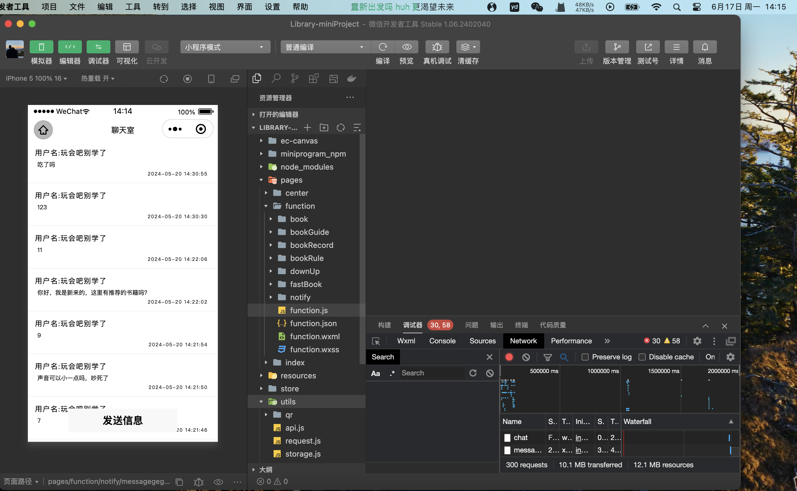

# 图书馆座位预约系统

## 简介

图书馆座位预约系统包括用户端（小程序）和管理员端（Web），用户可以通过系统预约图书馆座位，管理员可以管理预约信息。

### 功能特点

- **用户端（小程序）**：
    - **座位预约与取消**：用户可以通过小程序预约图书馆座位，并可以在需要时取消预约。
    - **预约记录查看**：用户可以查看自己的历史预约记录，了解过去的预约情况。
    - **在线聊天**：用户可以在图书馆在线聊天进行沟通，了解图书馆情况。
    - **消息提醒**：系统通过短信和邮箱提醒用户预约的状态和时间。

- **管理员端（Web）**：
    - **座位管理**：管理员可以管理图书馆的座位信息，包括添加、删除和修改座位。
    - **用户预约管理**：管理员可以查看和管理所有用户的预约信息，处理用户的预约请求和问题。
    - **系统设置与统计**：管理员可以进行系统设置，查看系统使用统计信息，包括预约使用情况和用户活跃度。

- **公共功能**：
    - **登录与注册**：用户和管理员可以通过系统进行注册和登录，支持基于JWT的身份验证。
    - **数据管理**：通过MyBatis进行数据库操作，使用Redis进行缓存管理，提高系统性能。
    - **短信与邮箱通知**：集成阿里云SMS和邮件服务，向用户发送预约确认和提醒消息。

### 技术栈

- **后端**：SpringBoot、MyBatis、Redis、MySQL、JWT、阿里云SMS、邮箱
- **前端**：微信小程序、HTML、CSS、JavaScript
- **其他**：JDK 1.8、MySQL 8.0、Redis 7.0

## 安装与配置

### 环境要求

- JDK 1.8
- MySQL 8.0
- Redis 7.0

### 安装步骤

1. **克隆项目**
    ```bash
    git clone https://github.com/your-repo/library-reservation-system.git
    cd library-reservation-system
    ```

2. **配置文件修改**
    - 在 `resource` 目录下修改 `application.properties` 文件中的 MySQL 和 Redis 配置。
    - 如果使用邮箱和短信服务，将 `resource/config/config.properties` 重命名为 `private-config.properties`
      ，并修改其中的配置（例如阿里云SMS和邮箱设置）。

3. **数据库初始化**
    - 在 Linux 下运行 `resource/sql/merge.sh` 脚本，将四个 SQL 脚本合并为 `all.sql`。
    - 导入合并后的 SQL 脚本到 MySQL 数据库：
        ```bash
        mysql -u your-username -p your-database < resource/sql/all.sql
        ```

4. **启动项目**
    ```bash
    mvn spring-boot:run
    ```

## 文件结构

```
Library-Server/
├── src/                        # 源代码目录
│   ├── main/
│   │   ├── java/
│   │   │   └── cool/
│   │   │       └── leeson/
│   │   │           └── library/
│   │   │               ├── config/        # 配置类
│   │   │               ├── controller/    # 控制器类
│   │   │               ├── dao/           # 数据访问对象类
│   │   │               ├── entity/        # 实体类
│   │   │               ├── exceptions/    # 异常处理类
│   │   │               ├── interceptor/   # 拦截器类
│   │   │               ├── service/       # 服务类
│   │   │               └── util/          # 工具类
│   │   ├── resources/
│   │   │   ├── application.properties     # 应用程序配置
│   │   │   ├── config/
│   │   │   │   └── config.properties      # 其他配置
│   │   │   ├── sql/
│   │   │   │   ├── all.sql                # 数据库脚本
│   │   │   │   ├── merge.sh               # 合并脚本
│   │   │   │   └── data/                  # 数据脚本
│   │   │   └── static/
│   │   │       └── img/                   # 静态图片资源
│   └── test/                              # 测试代码目录
├── .gitignore                  # Git忽略文件配置
├── LICENSE                     # 许可证文件
├── README.md                   # 项目介绍文件
├── mvnw                        # Maven Wrapper可执行文件
├── mvnw.cmd                    # Windows下的Maven Wrapper可执行文件
└── pom.xml                     # Maven项目配置文件

```

### 项目展示





## 贡献指南

欢迎贡献代码和报告问题！请遵循以下步骤：

1. Fork 本仓库
2. 创建新分支 (`git checkout -b feature/AmazingFeature`)
3. 提交更改 (`git commit -m 'Add some AmazingFeature'`)
4. 推送到分支 (`git push origin feature/AmazingFeature`)
5. 打开 Pull Request

## 联系方式

如有任何问题，请联系 hjl0301166@gmail.com。

感谢您的使用与支持！